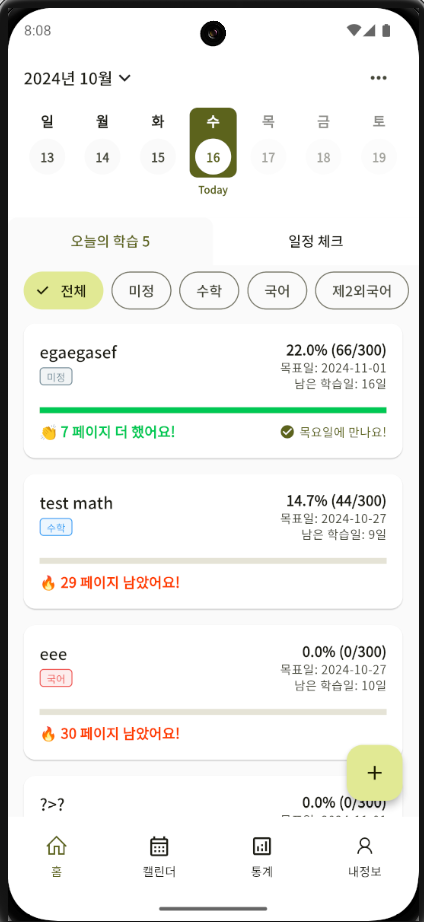
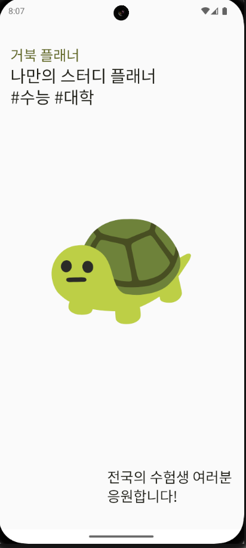

<h1 align= "center">📅 거북 플래너</h1>
<p align="center" width="100%">



</p>

## 프로젝트 구조

```
lib/src/
├── common_widgets/
├── constants/
├── controllers/        # GetX 컨트롤러
│   ├── auth/           # 로그인 & 인증 관련
│   ├── core/           # 공용 (하나의 Repository만 사용하여 재사용되는거 ex. UserController)
│   ├── screens/        # Screen에서 사용되는 컨트롤러 (ex. EditUserNameController)
│   └── theme/          # 테마 관련
├── data/
│   ├── models/         # 데이터 모델
│   └── repositories/   # 저장소 (여기서 Firebase 및 Hive 캐싱처리 함)
├── screens/
│   ├── auth/           # 로그인 안함
│   └── main/           # 로그인 함
└── utils/
    ├── constants/      # 상수 객체
    ├── exceptions/     # 예외 처리 객체
    ├── helper/         # 유틸리티 함수 객체
    ├── popups/         # 로딩 & 팝업 관련 유틸 함수 객체
    └── theme/          # 테마 관련
```

## 설정 방법

### Android 키스토어 정보 확인 [Windows 환경]

```
keytool -list -v -keystore "C:\Users\[사용자명]\.android\debug.keystore" -alias androiddebugkey -storepass android -keypass android
```

### iOS 설정

- [ ] Firebase iOS 설정 파일 업데이트 (GoogleService-info.plist)
- [ ] Easy Localization 설정 (https://pub.dev/packages/easy_localization)

### 참고사항

Hive 모델 생성을 위한 buildRunner 명령어:

```
flutter packages pub run build_runner build
```

## 개발 환경 설정

1. Flutter SDK 설치
2. 프로젝트 클론
3. 의존성 패키지 설치: `flutter pub get`
4. Firebase 프로젝트 설정 및 설정 파일 추가
5. Hive 모델 생성: `flutter packages pub run build_runner build`

## APK 빌드

```
flutter build apk --debug
flutter build apk --release
```
