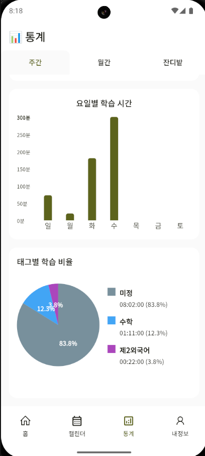

<h1 align= "center">📅 거북 플래너 v2</h1>
<p align="center" width="100%">



</p>

## 프로젝트 구조

```
lib/src/
├── common_widgets/
├── constants/

```

## 설정 방법

### Android 키스토어 정보 확인 [Windows 환경]

```
keytool -list -v -keystore "C:\Users\[사용자명]\.android\debug.keystore" -alias androiddebugkey -storepass android -keypass android
```

### 참고사항

Hive 모델 생성을 위한 buildRunner 명령어:

```
flutter packages pub run build_runner build
```

## 개발 환경 설정

1. Flutter SDK 설치
2. 프로젝트 클론
3. 의존성 패키지 설치: `flutter pub get`
4. Firebase 프로젝트 설정 및 설정 파일 추가
5. Hive 모델 생성: `flutter packages pub run build_runner build`

## APK 빌드

```
flutter build apk --debug
flutter build apk --release
```
